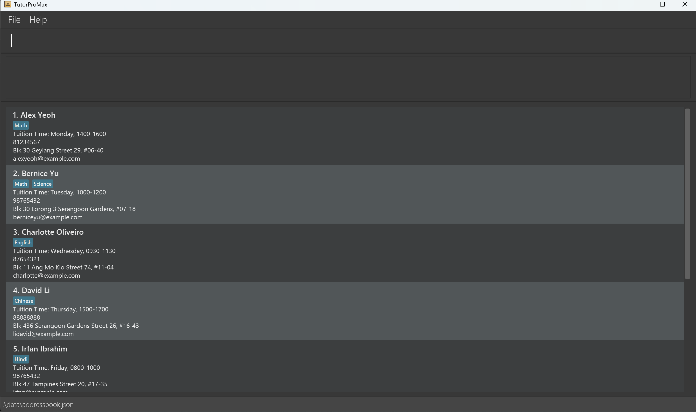
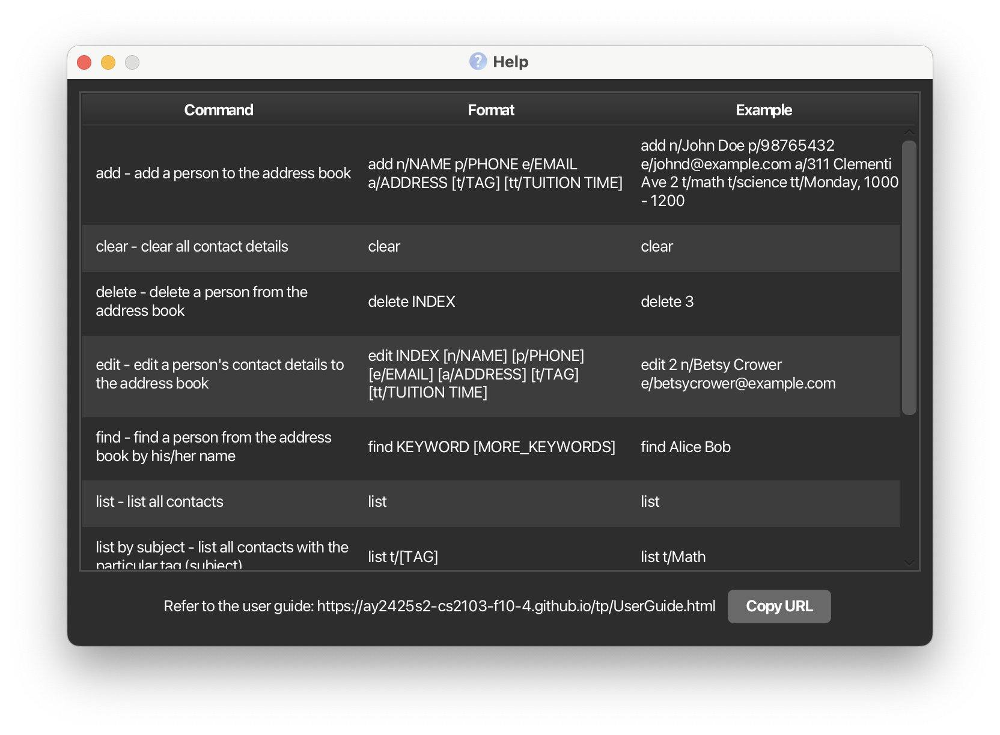

# 🧑‍🏫 TutorProMax

TutorProMax is a **desktop app for managing contacts, built specifically for private tutors  optimized for use via a Command Line Interface** (CLI) while still having the benefits of a Graphical User Interface (GUI). If you can type fast, TutorProMax can get your contact management tasks more efficiently than traditional GUI apps.

<!-- * Table of Contents -->
<page-nav-print />

## Why Choose TutorProMax?

TutorProMax isn't just another task management app — it's your ultimate companion for managing tutoring sessions and staying organized. Here's why you'll love it:

- 📚 **Tailored for Tutors**  
  Manage students, track lessons, set subject preferences, and manage tuition time with ease.

- ⏱️ **Fast workflow**  
  CLI commands let you manage your data quickly — perfect for fast typists.

- 🔒 **Offline and Secure**  
  No internet required. Your data stays private and local.

- 🖥️ **Portable**  
  Simple .jar file — no installation required.

> 🚀 **TutorProMax helps you save time and stay organised!**


--------------------------------------------------------------------------------------------------------------------

## Quick start

1. Ensure you have Java `17` or above installed in your Computer.<br>
   **Mac users:** Ensure you have the precise JDK version prescribed [here](https://se-education.org/guides/tutorials/javaInstallationMac.html).

1. Download the latest `.jar` file from [here](https://github.com/AY2425S2-CS2103-F10-4/tp/releases).

1. Copy the file to the folder you want to use as the _home folder_ for TutorProMax.

1. Open a command terminal, `cd` into the folder you put the jar file in, and use the `java -jar tutorpromax.jar` command to run the application.<br>
   - ```bash 
     cd path/to/your/folder
     java -jar tutorpromax.jar
   - Alternatively, for Mac users, double-click on the folder where the jar file is in, and select `open terminal at the filder`
   
3. A GUI similar to the below should appear in a few seconds. Note how the app contains some sample data.<br>
      

1. Type the command in the command box and press Enter to execute it. e.g. typing **`help`** and pressing Enter will open the help window.<br>
   Some example commands you can try:

   * `list` : Lists all contacts.

   * `add n/John Doe p/98765432 e/johnd@example.com a/John street, block 123, #01-01 t/Math t/Science tt/Friday, 1000-1200` : Adds a contact named `John Doe` to TutorProMax.

   * `delete 3` : Deletes the 3rd contact shown in the current list.

   * `clear` : Deletes all contacts.

   * `exit` : Exits the app.

   * `help` : Check for all available commands and their format.

1. Refer to the [Features](#features) below for details of each command.

--------------------------------------------------------------------------------------------------------------------

## Features

<box type="info" seamless>

**Notes about the command format:**<br>

* Words in `UPPER_CASE` are the parameters to be supplied by the user.<br>
  e.g. in `add n/NAME`, `NAME` is a parameter which can be used as `add n/John Doe`.

* Items in square brackets are optional.<br>
  e.g `n/NAME [t/TAG]` can be used as `n/John Doe t/Math` or as `n/John Doe`.

* Items with `…`​ after them can be used multiple times including zero times.<br>
  e.g. `[t/TAG]…​` can be used as ` ` (i.e. 0 times), `t/Math`, `t/Science t/English` etc.

* Parameters can be in any order.<br>
  e.g. if the command specifies `n/NAME p/PHONE_NUMBER`, `p/PHONE_NUMBER n/NAME` is also acceptable.

* Extraneous parameters for commands that do not take in parameters (such as `help`, `list`, `exit` and `clear`) will be ignored.<br>
  e.g. if the command specifies `help 123`, it will be interpreted as `help`.

* However, there are 2 extensions from the `list` command.
    * `list` without any command behind will be treated as the basic list command where all contacts will be listed.
    * `list t/` will list all students with the particular tag (subject).
    * `list tt/` will list all students with tuition on a particular day.

* If you are using a PDF version of this document, be careful when copying and pasting commands that span multiple lines as space characters surrounding line-breaks may be omitted when copied over to the application.
</box>

### Viewing help : `help`

Shows a list of commands available.
In addition, it shows a message explaining how to access the detailed help page.



Format: `help`


### Adding a person: `add`

Adds a person to the address book.

Format: `add n/NAME p/PHONE_NUMBER e/EMAIL a/ADDRESS tt/TUITION_TIME [t/TAG]…​`

<box type="tip" seamless>

**Tip:** A person can have any number of tags (including 0)
</box>

Examples:
* `add n/John Doe p/98765432 e/johnd@example.com a/John street, block 123, #01-01 tt/Monday, 1000-1200`
* `add n/Betsy Crowe t/friend e/betsycrowe@example.com a/Newgate Prison p/91234567 tt/Friday, 1400-1600 t/criminal`

### Listing all persons : `list`

Shows a list of all persons in the address book. Specify a subject or tuition time with keyword to 
list only persons with matching subject or tuition time. If both subject and tuition time are specified,
both filter will be applied and only persons that fulfil both criteria will be shown.

<<<<<<< HEAD
Format: `list [t/SUBJECT] [tt/TUITIONTIME]`
=======
Format:
* `list` - Lists all students
* `list t/[keyword_tag]` - Lists by tag
* `list tt/[keyword_tuition]` - Lists by tuition day (e.g. `Monday`, `mon`, etc.)

**Accepted day formats:** You can use **full day names** (`Monday`, `Tuesday`, ...) or **short forms** (`mon`, `tue`, `wed`, `thu`, `fri`, `sat`, `sun`). The search is **case-insensitive**.
>>>>>>> master

Examples:
* `list` Lists all persons in the address book.
* `list t/math` Lists all persons with keyword math in their tags (subjects).
<<<<<<< HEAD
* `list tt/monday` Lists all persons with keyword monday in their tuition times.
* `list t/math tt/Monday, 1000-1200` Lists all persons with keyword math in their 
tags (subjects) and tuition time of Monday, 1000-1200.
=======
* `list tt/monday` Lists all persons with tuition on Monday
* `list tt/mon` – Also lists persons with tuition on Monday (short form).
>>>>>>> master

### Editing a person : `edit`

Edits an existing person in the address book.

Format: `edit INDEX [n/NAME] [p/PHONE] [e/EMAIL] [a/ADDRESS] [t/TAG]…​`

* Edits the person at the specified `INDEX`. The index refers to the index number shown in the displayed person list. The index **must be a positive integer** 1, 2, 3, …​
* At least one of the optional fields must be provided.
* Existing values will be updated to the input values.
* When editing tags, the existing tags of the person will be removed i.e adding of tags is not cumulative.
* You can remove all the person’s tags by typing `t/` without
    specifying any tags after it.

Examples:
*  `edit 1 p/91234567 e/johndoe@example.com` Edits the phone number and email address of the 1st person to be `91234567` and `johndoe@example.com` respectively.
*  `edit 2 n/Betsy Crower t/` Edits the name of the 2nd person to be `Betsy Crower` and clears all existing tags.

### Locating persons by name: `find`

Finds persons whose names contain any of the given keywords.

Format: `find KEYWORD [MORE_KEYWORDS]`

* The search is case-insensitive. e.g `hans` will match `Hans`
* The order of the keywords does not matter. e.g. `Hans Bo` will match `Bo Hans`
* Only the name is searched.
* Only full words will be matched e.g. `Han` will not match `Hans`
* Persons matching at least one keyword will be returned (i.e. `OR` search).
  e.g. `Hans Bo` will return `Hans Gruber`, `Bo Yang`

Examples:
* `find John` returns `john` and `John Doe`
* `find alex david` returns `Alex Yeoh`, `David Li`<br>
  

### Sorting : `sort`
Sort the address book based on field specified.

Valid fields: `name`, `phone`, `email`, `address`, `tuition`, `tag`

Format: `sort field asc/desc`

Examples:
* `sort name asc` Sorts address book using ascending order of names.
* `sort tuition desc` Sorts address book using descending order of tuition times.
* `sort email asc` Sorts address book using ascending order of email addresses. 

<box type="warning" seamless>

**Possible Errors:**

❌ If you try to sort by an invalid field, TutorProMax will return:

`Invalid sort field. Valid fields: name, phone, email, address, tuition, tag`

</box> 

### Deleting a person : `delete`

Deletes the specified person from the address book.

Format: `delete INDEX`

* Deletes the person at the specified `INDEX`.
* The index refers to the index number shown in the displayed person list.
* The index **must be a positive integer** 1, 2, 3, …​

Examples:
* `list` followed by `delete 2` deletes the 2nd person in the address book.
* `find Betsy` followed by `delete 1` deletes the 1st person in the results of the `find` command.

### Clearing all entries : `clear`

Clears all entries from the address book.

Format: `clear`

### Exiting the program : `exit`

Exits the program.

Format: `exit`

### Saving the data

AddressBook data are saved in the hard disk automatically after any command that changes the data. There is no need to save manually.

### Editing the data file

AddressBook data are saved automatically as a JSON file `[JAR file location]/data/addressbook.json`. Advanced users are welcome to update data directly by editing that data file.

<box type="warning" seamless>

**Caution:**
If your changes to the data file makes its format invalid, AddressBook will discard all data and start with an empty data file at the next run.  Hence, it is recommended to take a backup of the file before editing it.<br>
Furthermore, certain edits can cause the AddressBook to behave in unexpected ways (e.g., if a value entered is outside the acceptable range). Therefore, edit the data file only if you are confident that you can update it correctly.
</box>

### Command History Navigation : arrow keys

Use the up (↑) and down (↓) arrow keys to navigate your previously entered commands.

* Pressing up (↑) cycles backward through your command history.

* Pressing down (↓) cycles forward to more recent commands.

* This helps quickly re-enter or modify past commands without retyping.

### Archiving data files `[coming in v2.0]`

_Details coming soon ..._

--------------------------------------------------------------------------------------------------------------------

## FAQ

**Q**: How do I transfer my data to another Computer?<br>
**A**: Install **TutorProMax** on the new computer.

- Run the app once to generate the necessary data folder.

- On your original computer, navigate to the folder:
`[TutorProMax]/data/addressbook.json`

- Copy the `addressbook.json` file (this contains your data) to a USB drive or cloud storage.

- On the new computer, go to the same directory:
`[TutorProMax]/data/`

- Replace the newly created `addressbook.json` with your copied version.

- Launch TutorProMax. Your previously saved contacts should now be visible.

<box type="info" seamless> **Tip:** If you're unsure where the data folder is located, it is usually in the installation directory where **TutorProMax** was unzipped or installed. You can also check `preferences.json` for the exact path. </box>

--------------------------------------------------------------------------------------------------------------------

## Known issues

1. **When using multiple screens**, if you move the application to a secondary screen, and later switch to using only the primary screen, the GUI will open off-screen. The remedy is to delete the `preferences.json` file created by the application before running the application again.
2. **If you minimize the Help Window** and then run the `help` command (or use the `Help` menu, or the keyboard shortcut `F1`) again, the original Help Window will remain minimized, and no new Help Window will appear. The remedy is to manually restore the minimized Help Window.

--------------------------------------------------------------------------------------------------------------------

## Command summary

Action     | Format, Examples
-----------|----------------------------------------------------------------------------------------------------------------------------------------------------------------------
**Add**    | `add n/NAME p/PHONE_NUMBER e/EMAIL a/ADDRESS tt/TUITION_TIME [t/TAG]…​` <br> e.g., `add n/James Ho p/22224444 e/jamesho@example.com a/123, Clementi Rd, 1234665 tt/Monday, 1000-1200 t/friend t/colleague`
**Clear**  | `clear`
**Delete** | `delete INDEX`<br> e.g., `delete 3`
**Edit**   | `edit INDEX [n/NAME] [p/PHONE_NUMBER] [e/EMAIL] [a/ADDRESS] [t/TAG]…​`<br> e.g.,`edit 2 n/James Lee e/jameslee@example.com`
**Find**   | `find KEYWORD [MORE_KEYWORDS]`<br> e.g., `find James Jake`
**Sort**   | `sort [field] asc/desc`<br> e.g. `sort name asc`
**List**   | `list [t/SUBJECT] [tt/TUITIONTIME]` <br> e.g. `list` <br> e.g. `list t/Math` <br> e.g. `list tt/Monday` or `list tt/mon`
**Help**   | `help`
